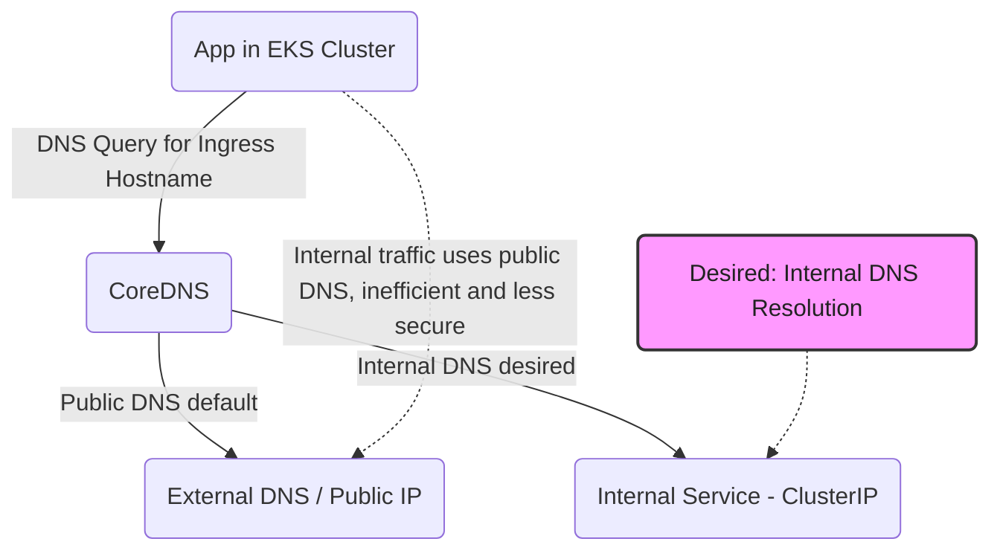
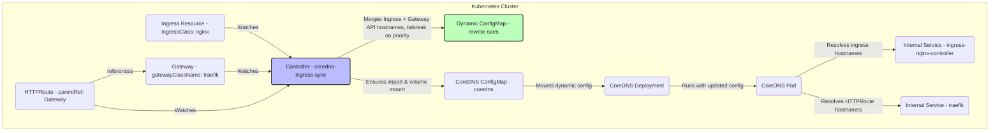

# Problem Overview: Internal DNS Resolution



**Explanation:**
- By default, internal apps resolve ingress hostnames to public IPs, even for internal traffic.
- The goal is to have CoreDNS resolve these hostnames to an internal ClusterIP for internal traffic, improving efficiency and security.

# Solution Architecture: How the Controller Works



**Explanation:**
- The controller watches Ingress resources, and, when `gatewayClassMappings` is configured, also watches Gateway and HTTPRoute resources — mirroring the Ingress path but keying off `gatewayClassName` instead of `ingressClassName`.
- Hostnames from both sources are merged into a single set of rewrite rules. If an Ingress and an HTTPRoute claim the same hostname, the Ingress wins by default (Gateway API can be promoted per-host via the existing priority annotation).
- Gateway API support is purely additive and opt-in: when `gatewayClassMappings` is unset, no watches, RBAC, or CRD List/Get calls are added, and behavior is identical to Ingress-only operation.
- It ensures CoreDNS is configured to import these rules and mounts the config.
- CoreDNS then resolves ingress/HTTPRoute hostnames to the internal service address for internal traffic.
# How It Works

This document explains the technical implementation and architecture of the coredns-ingress-sync controller.

## Architecture Overview

The coredns-ingress-sync controller follows the Kubernetes controller pattern, using controller-runtime for
efficient event-driven reconciliation. It acts as a bridge between Ingress resources and CoreDNS configuration,
with support for **namespace filtering** and **modular CI/CD automation**.

```text
┌─────────────────┐    ┌──────────────────┐    ┌─────────────────┐
│     Ingress     │    │                  │    │     CoreDNS     │
│   Resources     │───▶│   Controller     │───▶│  Configuration  │
│ (All/Filtered)  │    │ (NS-aware)       │    │                 │
└─────────────────┘    └──────────────────┘    └─────────────────┘
                              │
                              ▼
                    ┌─────────────────┐
                    │ Dynamic ConfigMap│
                    │ (coredns-ingress-sync-rewrite-rules) │
                    └─────────────────┘
```

**Namespace Monitoring**: The controller can operate in two modes:

- **Cluster-wide**: Monitors ingresses across all namespaces (requires ClusterRole)
- **Namespace-scoped**: Monitors only specific namespaces (uses per-namespace Roles)

**Gateway API Support (optional)**: alongside Ingress, the controller can watch `Gateway` and
`HTTPRoute` resources (`gateway.networking.k8s.io/v1`), configured via `gatewayClassMappings`. This
mirrors the Ingress pipeline: a `gatewayapi.Filter` (in `internal/gatewayapi`) matches HTTPRoutes to
their parent Gateway's `gatewayClassName` and applies the same namespace/annotation filtering as
Ingress (shared via `internal/filterutil`). Candidate hostnames from both sources are merged through
a shared tiebreak function (`internal/hostmap`), with Ingress winning ties by default. When
`gatewayClassMappings` is empty (the default), no Gateway API watches, caches, RBAC, or List/Get
calls are added — behavior is identical to a pre-Gateway-API deployment. HTTPRoute acceptance status
(`status.parents[].conditions[type=Accepted]`) is not checked; a rejected or conflicting HTTPRoute
still produces a rewrite rule, matching how Ingress spec is trusted without checking controller
acceptance.

## Component Breakdown

### 1. Controller Runtime Framework

The controller uses the controller-runtime library for:

- **Event-driven reconciliation**: Responds to Ingress and ConfigMap changes
- **Leader election**: Supports multiple replicas with automatic leader selection
- **Efficient caching**: Minimizes API server load through smart caching
- **Retry logic**: Automatic retry on transient failures

```go
// Controller setup with multiple watches
mgr, err := ctrl.NewManager(ctrl.GetConfigOrDie(), ctrl.Options{
    LeaderElection:          true,
    LeaderElectionID:        "coredns-ingress-sync-leader",
    HealthProbeBindAddress:  ":8081",
})

// Watch Ingress resources
controller.Watch(
    source.Kind(mgr.GetCache(), &networkingv1.Ingress{}),
    handler.EnqueueRequestsFromMapFunc(mapIngressesToReconcile),
    predicate.Funcs{CreateFunc: isTargetIngress, UpdateFunc: hasIngressChanged},
)
```text

### 2. Ingress Processing Pipeline

```text
Ingress Event → Filter by IngressClass → Extract Hostnames → Generate Config → Update ConfigMap
```

#### Ingress Filtering

The controller only processes Ingresses that match the configured IngressClass:

```go
func isTargetIngress(obj client.Object) bool {
    ingress, ok := obj.(*networkingv1.Ingress)
    if !ok {
        return false
    }
    return ingress.Spec.IngressClassName != nil &&
           *ingress.Spec.IngressClassName == ingressClass
}
```

#### Hostname Extraction

Extracts all unique hostnames from matching Ingress rules:

```go
func extractHostnames(ingresses []networkingv1.Ingress) []string {
    hostSet := make(map[string]bool)

    for _, ing := range ingresses {
        if ing.Spec.IngressClassName == nil || *ing.Spec.IngressClassName != ingressClass {
            continue
        }

        for _, rule := range ing.Spec.Rules {
            if rule.Host != "" {
                hostSet[rule.Host] = true
            }
        }
    }

    return mapKeysToSlice(hostSet)
}
```

### 3. Configuration Generation

The controller generates CoreDNS rewrite rules for each discovered hostname:

```go
func generateDynamicConfig(hosts []string) string {
    var config strings.Builder

    config.WriteString("# Auto-generated by coredns-ingress-sync controller\n")
    config.WriteString(fmt.Sprintf("# Last updated: %s\n", time.Now().Format(time.RFC3339)))
    config.WriteString("\n")

    for _, host := range hosts {
        config.WriteString(fmt.Sprintf(
            "rewrite name exact %s %s\n",
            host,
            targetCNAME,
        ))
    }

    return config.String()
}
```

#### Example Output

```dns
# Auto-generated by coredns-ingress-sync controller
# Last updated: 2025-01-16T10:30:00Z

rewrite name exact api.example.com ingress-nginx-controller.ingress-nginx.svc.cluster.local.
rewrite name exact web.example.com ingress-nginx-controller.ingress-nginx.svc.cluster.local.
```

### 4. CoreDNS Integration

The controller integrates with CoreDNS through two mechanisms:

#### Automatic Configuration (Recommended)

When `COREDNS_AUTO_CONFIGURE=true`:

1. **Import Statement**: Adds `import /etc/coredns/custom/*.server` to CoreDNS Corefile
2. **Volume Mount**: Adds volume mount for dynamic ConfigMap
3. **Volume**: Creates ConfigMap volume reference

```go
func (r *IngressReconciler) ensureCoreDNSConfiguration(ctx context.Context) error {
    // Add import statement to Corefile
    if err := r.ensureCoreDNSImport(ctx); err != nil {
        return err
    }

    // Add volume mount to deployment
    if err := r.ensureCoreDNSVolumeMount(ctx); err != nil {
        return err
    }

    return nil
}
```

#### Manual Configuration

For environments where automatic configuration is not desired:

1. Manually add import statement to CoreDNS Corefile
2. Manually configure volume mount
3. Set `COREDNS_AUTO_CONFIGURE=false`

### 5. Dynamic ConfigMap Management

The controller manages a dedicated ConfigMap (`coredns-ingress-sync-rewrite-rules`) containing the dynamic configuration:

```yaml
apiVersion: v1
kind: ConfigMap
metadata:
  name: coredns-ingress-sync-rewrite-rules
  namespace: kube-system
  labels:
    app.kubernetes.io/managed-by: coredns-ingress-sync
data:
  dynamic.server: |
    # Auto-generated by coredns-ingress-sync controller
    # Last updated: 2025-01-16T10:30:00Z

    rewrite name exact api.example.com ingress-nginx-controller.ingress-nginx.svc.cluster.local.
    rewrite name exact web.example.com ingress-nginx-controller.ingress-nginx.svc.cluster.local.
```

#### ConfigMap Update Strategy

The controller uses optimistic concurrency control to handle concurrent updates:

```go
func (r *IngressReconciler) updateDynamicConfigMap(ctx context.Context, hosts []string) error {
    for attempt := 0; attempt < 3; attempt++ {
        configMap := &corev1.ConfigMap{}

        // Fresh read on each attempt
        err := r.Get(ctx, configMapName, configMap)
        if err != nil {
            // Create if doesn't exist
            return r.createDynamicConfigMap(ctx, hosts)
        }

        // Check if update is actually needed
        newConfig := generateDynamicConfig(hosts)
        if configMap.Data[dynamicConfigKey] == newConfig {
            return nil // No change needed
        }

        // Update with new configuration
        configMap.Data[dynamicConfigKey] = newConfig
        if err := r.Update(ctx, configMap); err != nil {
            if attempt == 2 {
                return err
            }
            time.Sleep(100 * time.Millisecond) // Brief backoff
            continue
        }

        return nil
    }
}
```

### 6. Reconciliation Logic

The controller uses a single reconciliation function for all events:

```go
func (r *IngressReconciler) Reconcile(ctx context.Context, req reconcile.Request) (reconcile.Result, error) {
    // 1. List all ingresses in the cluster
    var ingressList networkingv1.IngressList
    if err := r.List(ctx, &ingressList); err != nil {
        return reconcile.Result{RequeueAfter: time.Minute}, err
    }

    // 2. Extract hostnames from matching ingresses
    hosts := extractHostnames(ingressList.Items)

    // 3. Update dynamic ConfigMap
    if err := r.updateDynamicConfigMap(ctx, hosts); err != nil {
        return reconcile.Result{RequeueAfter: time.Minute}, err
    }

    // 4. Ensure CoreDNS configuration is correct
    if err := r.ensureCoreDNSConfiguration(ctx); err != nil {
        log.Printf("Warning: Failed to ensure CoreDNS configuration: %v", err)
        // Don't fail reconciliation if CoreDNS is not available
    }

    return reconcile.Result{}, nil
}
```

### 7. Event Handling

The controller watches multiple resource types:

#### Ingress Events

- **Create**: New hostname added to configuration
- **Update**: Hostname changes reflected in configuration
- **Delete**: Hostname removed from configuration

#### ConfigMap Events

- **CoreDNS ConfigMap**: Defensive configuration management
- **Dynamic ConfigMap**: External update detection

```go
// Example: Ingress create event flow
Ingress Created → Event Generated → Reconcile Triggered →
Hostnames Extracted → Configuration Updated → ConfigMap Updated →
CoreDNS Reloads → DNS Resolution Active
```

### 8. Error Handling and Resilience

The controller implements several resilience patterns:

#### Retry Logic

```go
// Automatic retry on reconciliation failures
if err := r.reconcileIngresses(ctx); err != nil {
    return reconcile.Result{RequeueAfter: time.Minute}, err
}
```

#### Defensive Configuration Management

Protects against external modification of CoreDNS configuration:

```go
// Watch CoreDNS ConfigMap for external changes
if !strings.Contains(corefile, importStatement) {
    log.Printf("Import statement missing, re-adding...")
    return r.ensureCoreDNSImport(ctx)
}
```

#### Graceful Degradation

The controller continues operating even if CoreDNS management fails:

```go
if err := r.ensureCoreDNSConfiguration(ctx); err != nil {
    log.Printf("Warning: CoreDNS configuration failed: %v", err)
    // Continue with ConfigMap update
}
```

## Performance Characteristics

### Memory Usage

- **Base memory**: ~32Mi for controller runtime overhead
- **Per ingress**: ~0.1Mi additional memory per ingress hostname
- **Scaling**: Linear memory growth with number of ingresses

### CPU Usage

- **Idle**: ~5m CPU when no ingress changes
- **Processing**: ~20m CPU during batch ingress updates
- **Reconciliation**: <100ms average reconciliation time

### Network Impact

- **API calls**: Minimized through controller-runtime caching
- **ConfigMap updates**: Only when actual changes detected
- **Watch efficiency**: Uses Kubernetes watch API for real-time updates

## Security Considerations

### RBAC Permissions

The controller uses minimal required permissions:

```yaml
# Cluster-wide permissions (read-only)
- apiGroups: ["networking.k8s.io"]
  resources: ["ingresses"]
  verbs: ["get", "list", "watch"]

# Only added when controller.gatewayClassMappings is set
- apiGroups: ["gateway.networking.k8s.io"]
  resources: ["gateways", "httproutes"]
  verbs: ["get", "list", "watch"]

# Namespace-scoped permissions
- apiGroups: [""]
  resources: ["configmaps"]
  verbs: ["get", "list", "watch", "create", "update", "patch"]
```

### Security Context

Runs with non-root user and restricted capabilities:

```yaml
securityContext:
  allowPrivilegeEscalation: false
  capabilities:
    drop: ["ALL"]
  readOnlyRootFilesystem: true
  runAsNonRoot: true
  runAsUser: 65534
```

### Network Policies

Can be restricted with network policies to limit cluster network access.

## Monitoring and Observability

### Health Checks

The controller exposes health check endpoints:

- `/healthz`: Basic health check
- `/readyz`: Readiness check (considers leader election)

### Logging

Structured logging with configurable levels:

```go
log.Printf("[%s] Successfully updated ConfigMap with %d hosts", podName, len(hosts))
log.Printf("[%s] Reconciling changes for request: %s", podName, req.NamespacedName)
```

### Metrics

The controller provides comprehensive Prometheus metrics for monitoring and alerting:

**Reconciliation Metrics:**

- `coredns_ingress_sync_reconciliation_total{result}` - Total reconciliation attempts (success/error)
- `coredns_ingress_sync_reconciliation_duration_seconds{result}` - Reconciliation duration histogram
- `coredns_ingress_sync_reconciliation_errors_total{error_type}` - Reconciliation errors by type

**DNS Management Metrics:**

- `coredns_ingress_sync_dns_records_managed_total` - Current number of DNS records managed
- `coredns_ingress_sync_coredns_config_updates_total{result}` - CoreDNS configuration updates
- `coredns_ingress_sync_coredns_config_update_duration_seconds{result}` - Config update duration

**Ingress Monitoring Metrics:**

- `coredns_ingress_sync_ingresses_watched_total{namespace}` - Current ingresses watched per namespace
- `coredns_ingress_sync_ingresses_processed_total{namespace,action}` - Ingresses processed by action

**System Metrics:**

- `coredns_ingress_sync_leader_election_status` - Leader election status (1=leader, 0=follower)
- `coredns_ingress_sync_coredns_config_drift_total{drift_type}` - Configuration drift detection/correction

**Metrics Endpoint:**

- Port: 8080 (configurable via Helm)
- Path: `/metrics`
- ServiceMonitor support for Prometheus Operator

**Implementation Details:**

- Uses controller-runtime's built-in metrics registry
- Metrics are automatically registered on startup
- Leader election status is updated during manager lifecycle
- Configuration drift metrics track defensive operations

## CI/CD Architecture

### Modular Pipeline Design

The project uses a **modular CI/CD approach** with reusable GitHub Actions:

```text
┌─────────────────┐    ┌──────────────────┐    ┌─────────────────┐
│  Pull Request   │    │   Reusable       │    │   Production    │
│   Validation    │───▶│   Actions        │───▶│   Deployment    │
│                 │    │                  │    │                 │
└─────────────────┘    └──────────────────┘    └─────────────────┘
        │                       │                       │
        ▼                       ▼                       ▼
┌─────────────┐         ┌─────────────┐         ┌─────────────┐
│ docker-build│         │ test-runner │         │ build-push  │
│ security-scan│         │ update-pr   │         │ helm-release│
│ docs-check  │         │ status      │         │ security    │
└─────────────┘         └─────────────┘         └─────────────┘
```

**Key Components**:

- **Reusable Actions**: Four modular actions for build, test, security, and status management
- **Artifact-based Workflows**: Build once, test multiple times pattern
- **Parallel Execution**: Security scans, tests, and builds run concurrently
- **Status Management**: Automated PR status updates for release-please integration

See [CI/CD Documentation](CI_CD_DOCS.md) for detailed pipeline architecture.
